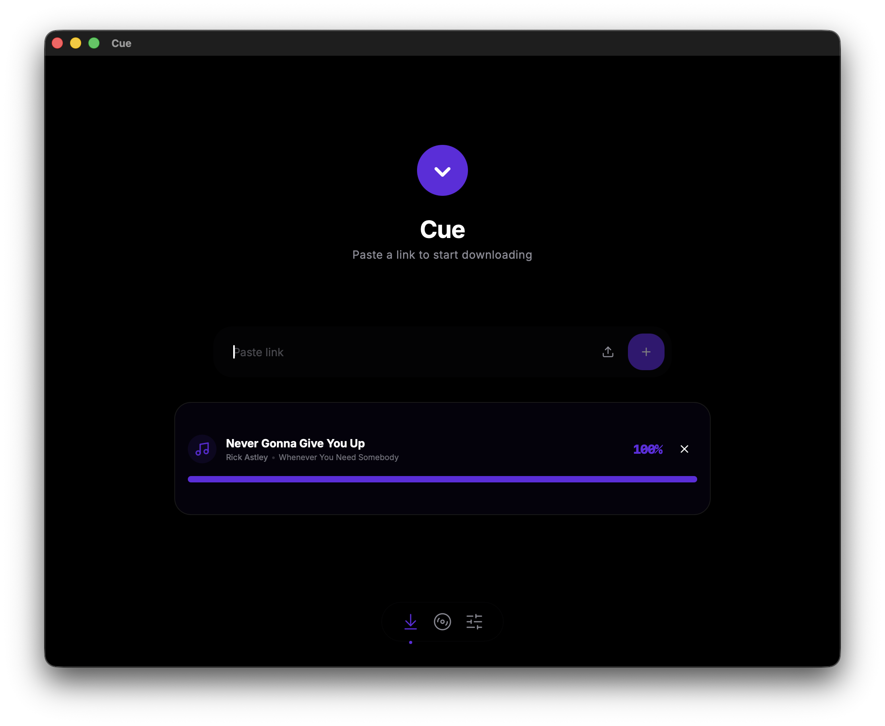
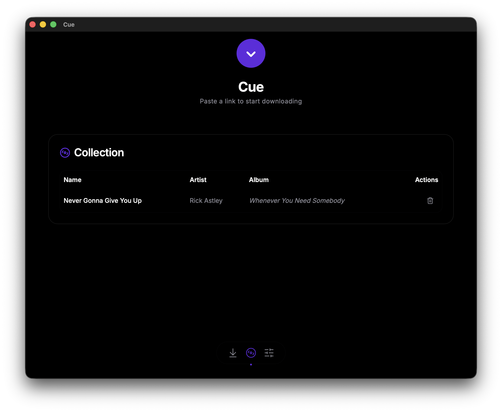

#  Cue

**Cue** is a premium, opinionated media management utility for DJs. It removes technical friction from media acquisition and library organization, providing a native Apple-style experience.

[](https://opensource.org/licenses/MIT)
[](https://github.com/sousandrei/cue/releases)

---

<p align="center">
  
</p>

## How to use Cue

Cue is designed to be invisible. Just focus on your music.

1.  **Add Music:** Paste a link (YouTube, SoundCloud, etc.) into the main intake field and click **Add**.
2.  **Monitor:** Watch the progress in your **Collection**. Cue automatically handles the high-quality download and metadata tagging.
3.  **Organize:** View and manage your tracks in the Collection tab.
4.  **Sync:** When ready, use **Push to Rekordbox** to sync your library with your DJ software.

## Features

*   **Zero-Config:** No bitrate sliders or technical jargon. Cue defaults to 320kbps MP3.
*   **Automatic Setup:** On first launch, Cue automatically downloads its required dependencies (`yt-dlp` and `ffmpeg`) to ensure everything works out of the box.
*   **Minimalist Design:** A pure black canvas optimized for focus.

<p align="center">
  
</p>

## Downloads & Releases

Stable versions of Cue are available for macOS, Windows, and Linux.

👉 **[Download the latest release on GitHub](https://github.com/sousandrei/cue/releases)**

*Choose the installer for your platform (e.g., `.dmg` for Mac, `.exe` for Windows, `.deb` or `AppImage` for Linux).*

## Development

Cue is built with [Tauri](https://tauri.app/) and [Vite](https://vitejs.dev/) using React and Tailwind CSS.

### Prerequisites

- [Bun](https://bun.sh/)
- [Rust](https://www.rust-lang.org/)

### Setup

1.  **Install dependencies:**
    ```bash
    bun install
    ```

2.  **Run in development mode:**
    ```bash
    bun tauri dev
    ```

3.  **Build the application:**
    ```bash
    bun tauri build
    ```

## License

This project is licensed under the MIT License.
